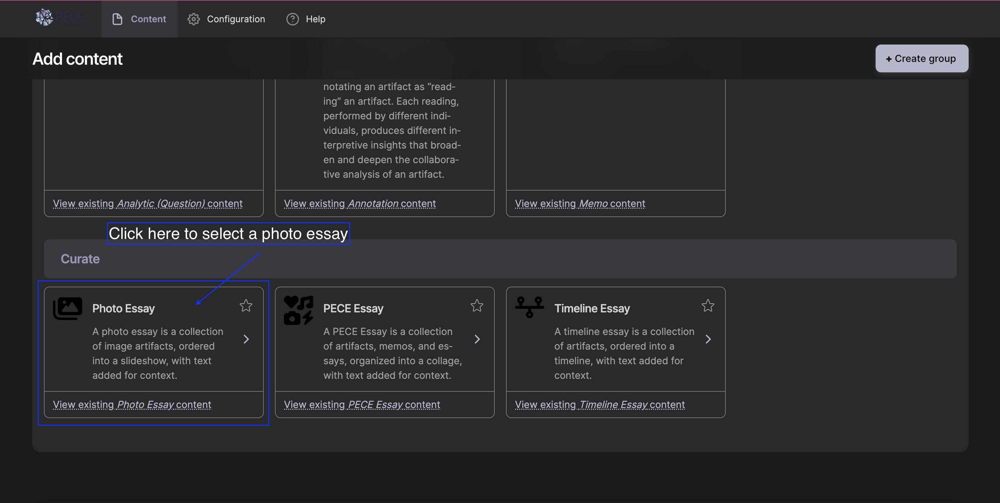
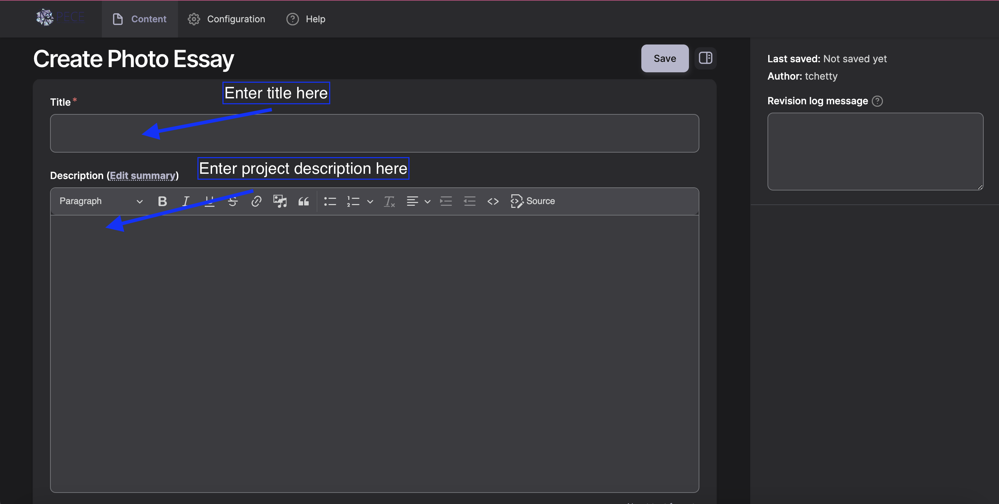
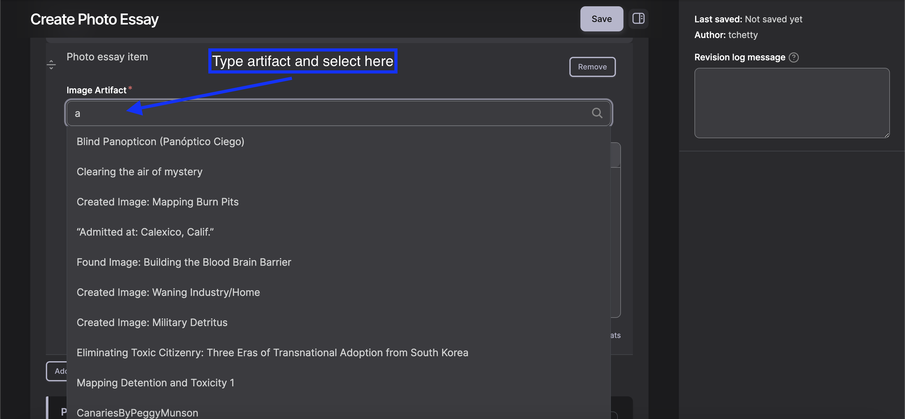

Steps to Create a Photo Essay

1. The process of adding any variety of content to PECE begins by logging in with your screen name and password and clicking “Create Content” in the top right corner.

You should now see the "Add content" page.

On this page you will find a grid of options for creating different forms of new content followed by their brief descriptions. "Photo Essay" is one type of content, located in the "Curate" section. A photo essay is a collection of image artifacts, ordered into a slideshow, with text added for context.

2. Click “Photo Essay”

You should now have access to all of the fields you need to fill out in order to create a new Photo Essay.

3. First, type the title in the “Title” pane.
Next, write out your project description in the “Description” section.

4. You are now ready to upload your image artifacts into your Photo Essay.
In the "Items" section, begin by typing the title of the image artifact into the “Image Artifact” pane. Your Image Artifact should pop up as an option to select.

Click on the title of your Image Artifact to select it.
Next, type in the “Substantive Caption” into the “Text” pane.

5. Once this artifact is added, click “Add Photo essay item.” Repeat Step 4 for your remaining Image Artifacts.

6. Next, scroll down to the metadata fields. The menu bar on the left side will automatically be open to the "Permission, Authorship, and Groups" section. Your screen name should already appear in the first contributor field. Listed contributors have the ability to edit the content, and are also credited as content contributors when the content is published. To add the names of any other project members who you would like to grant access to editing the artifact, type the first few letters of their name into the other “contributor” field. To add more than one additional contributor, click the "add another item" button and enter their name in the new field.

7. Next, scroll down to the "View Permission and Groups" section. The button switch will automatically set viewing permissions to "Everyone can view this content," making the artifact visible to all internet users. If you want to restrict access to the content, click the button switch to turn this off. If you choose to leave the toggle on, you can still associate the content with a particular group. To do so, complete the "Group association and view access." You can select a group with which to associate the content by typing its name into the field. If you choose to restrict access to the content, you can designate specific people or groups that will have view access. To allow specific people viewing access, in the field, "People with view access" type the first few letters of their name and select their username. Add groups whose members should have view access to this memo by typing the group name into the "Group association and view access" field. Note that if you give a group view access, it will also associate the content with that group. This means the content will appear on the group's page.

INSERT SCREENSHOT

8. Next, fill out the "Contribution Metadada" section, making sure to select the correct license and add any critical commentary. For the license, we encourage you to leave it as Attribution, Share Alike CC BY-SA, but you can choose any of the other Creative Commons license as you see fit. Descriptions of available creative commons licenses can be found here.

Tag the content. As you type, suggested tags will be automatically generated if they exist already in the system. We recommend following theses suggestions and using existing tags if they are not too different from what you were intending, but feel free to make up new tags!

INSERT SCREENSHOT

9. Next, fill out the "Custom Citation" section, using your platform's preferred citation format.

INSERT SCREENSHOT

10. Next Choose a “thumbnail” image to represent your essay.

You can edit this image later.
Click "Add media" to upload the image. Type in Alt Text and/or Title Text as desired (you can simply leave these blank), and click "Save and Insert" tp upload.

INSERT SCREENSHOT

Click save at the top to save your work. 
Congratulations! You’ve created your Photo Essay!
