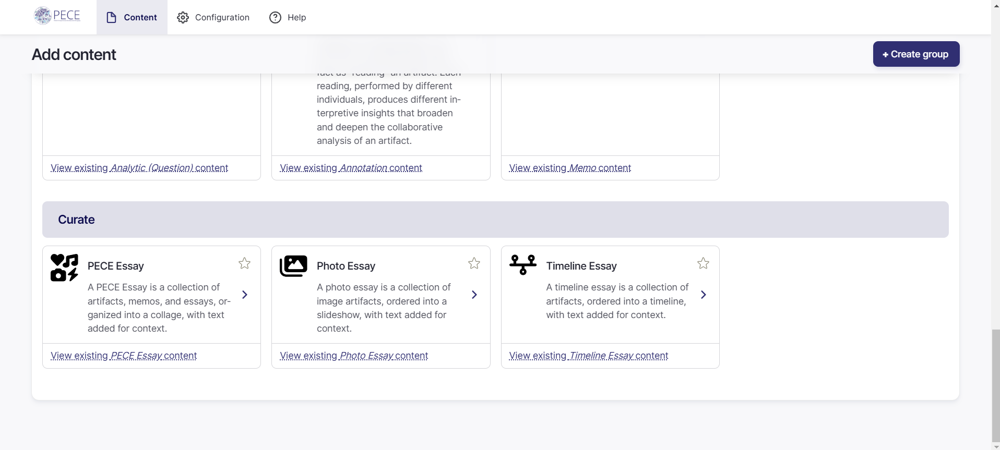
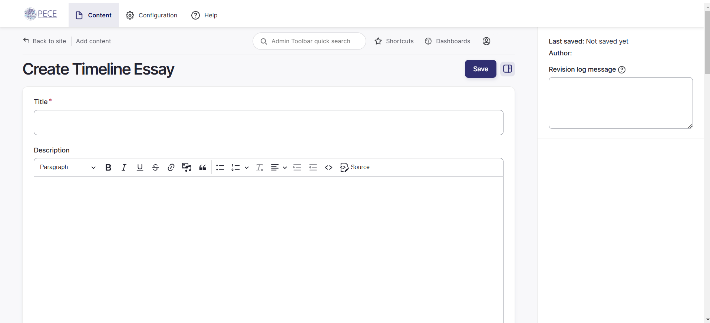
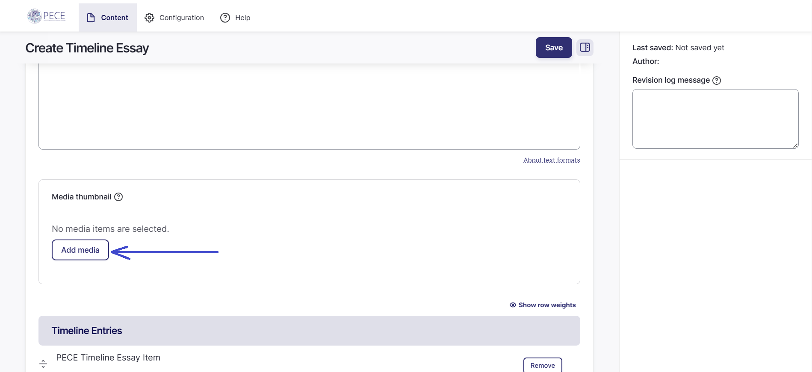
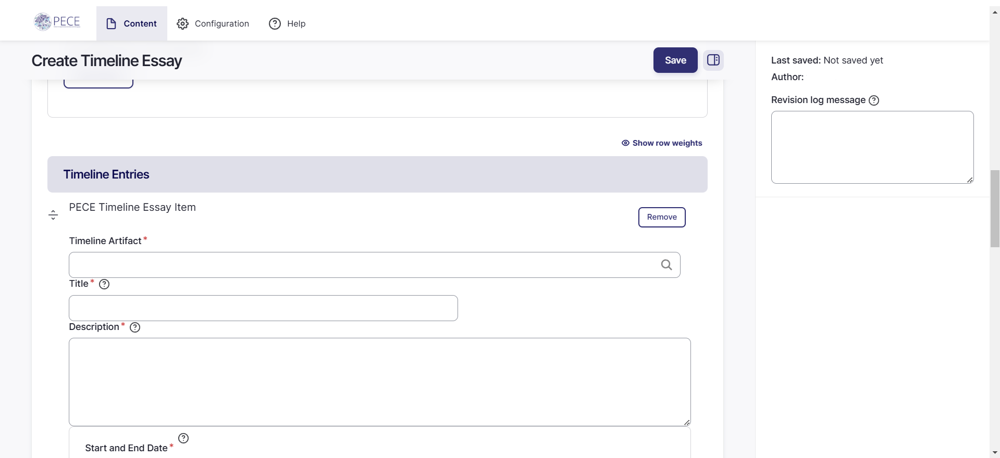
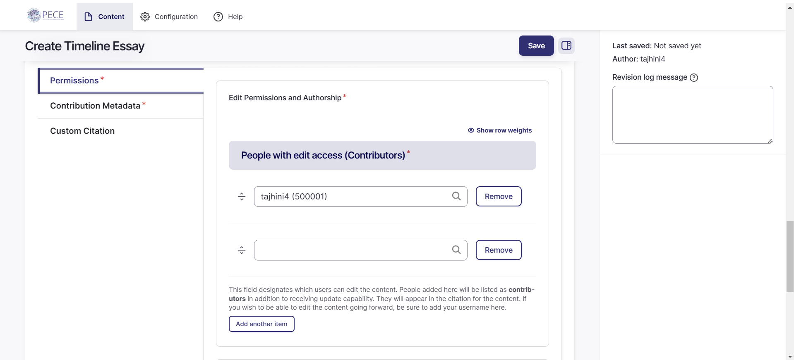
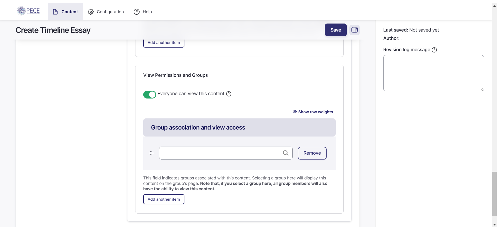
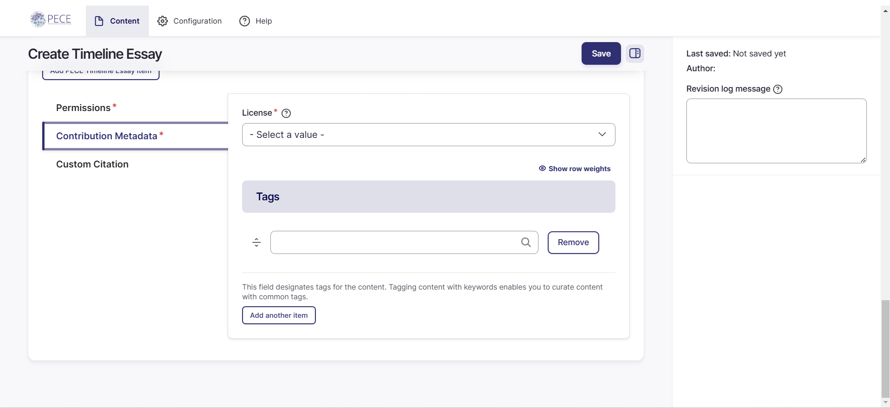

Timeline Essay
=====================

Steps to Create a Timeline Essay
---------------------------------------
1. The process of adding any variety of content to PECE begins by logging in with your screen name and password and clicking “Create Content” in the top right corner.

    

2. You should now see the "Add content" page.

    

    As you scroll down the page, you can find thumbnails
    for creating different forms of new content. Each is organised under a category. "Timeline Essay" can be found under the category "Curate". "Timeline Essay" is one of the types of content. A timeline essay is a collection of artifacts, ordered into a timeline, with text added for context.

    

3. To create a timeline essay, click on the "Timeline Essay" thumbnail.

    

4. This takes you to the "Create Timeline Essay" page. You should now have access to all of the fields you need to fill out in order to create a new timeline essay. First, type the title of your timeline essay in the “Title” field.

    

5. Type a description of your timeline essay into the "Description" field.
   
6. Next, is the "Media thumbnail". Select the "Add media" button, to add a form of media to your timeline essay.
    In the pop-up window that appears, select a media file from your device.
    After your media has been selected, add a short description of the image used by screen readers and displayed when the image is not loaded. This is important for accessibility.
    Select "Save and insert" to save the image.

7. The next section is the "Timeline Entries" section.
    Here you can select artifacts to add to the timeline essay by typing in the first few letters of the artifact's title. Select the artifact from the drop-down menu.

    Each timeline essay item has a title, description, date, and referenced artifact. The "Title" field indicates a title for the timeline essay item. It will appear as a heading at the top of the essay item. Enter a title for your timeline essay item.

    Add a description of the artifact and a date or date range for the timeline essay item. It will determine where along the timeline the essay item displays.

    Choose a background image from your local device as well as a background colour. This color will appear in the background of the timeline essay item. If you select a color, you should also set the background opacity to a value between 0 (transparent) and 1 (opaque). (e.g. 0.5 will set the background color to half opacity). Type this value into the "Opacity" box.

    To add more timeline essay items, select the "Add PECE Timeline Essay Item".

8. Next are three tabs: "Permissions", "Contribution Metadata" and Custom Citation. The "Permissions, Authorship, and Groups" should be automatically opened.

    In the "Edit Permissions and Authorship" section, you should be automatically added as a contributor as your username. Listed contributors have the ability to edit the content, and are also credited as content contributors when the content is published. If there are any other contributors, add them by typing the first few letters of their name into the field. Their screen name should pop up. Select their name. To add more than one contributor other than yourself, click the "Add another item" button and repeat the same process.

    

9. Next, in the "View Permissions and Groups", you will come across the "Everyone can view this content" toggle. By default, the toggle will be set to on, meaning everyone on the Web can view the content. If you want to restrict access to the content, turn this off.

    If you choose to leave the toggle on, you can still associate the content with a particular group. To do so, complete the "Group association and view access." You can select a group with which to associate the content by typing its name into the field.

    

    If you choose to restrict access to the content, you can designate specific people or groups that will have view access. Add the people who should have view access to this timeline essay by typing their screen name into the "People with view access" field. Add groups whose members should have view access to this timeline essay by typing the group name into the "Group association and view access" field. **Note that if you give a group view access, it will also associate the content with that group. This means the content will appear on the group's page.**

    

10. Next, click on the "Contribution Metadata" tab.

    

11. Complete the "License" field by selecting a license from the drop-down menu. This indicates how the content should be licensed. We encourage you to leave it as Attribution, Share Alike CC BY-SA, but you can choose any of the other Creative Commons licenses as you see fit. Please refer to the [*Licensing*](https://creativecommons.org/share-your-work/cclicenses/) section for more information.

    

12. Next, add optional keyword tags to your timeline essay. Tag the content. As you type, suggested tags will be automatically generated if they exist already in the system. We recommend following these suggestions and using existing tags if they are not too different from what you intended, but feel free to make up new tags!

    

13. In the "Custom Citation" tab, you have the option to cite your timeline essay as a part of a particular project.
    When you save this content, a suggested citation will be auto-created by the platform. If this content is generated from or associated with a particular project on the platform, this field indicates which project the content should be cited as part of. You may leave this field blank if the content does not need to be cited as part of a particular project.

    There is also the option to enable ARK. ARKs (Archival Resource Keys) serve as persistent identifiers, or stable, trusted references for an information object. They are like DOIs but are open, decentralized, and non-paywalled; you can assign an ARK to almost any content you create, but they should be used thoughtfully for content whose long-term accessibility is vital. This is toggled on by default but you have the option to disable ARKs.

14. Finally, click “Save” at the top of the page to save your work. And remember: all of these settings can be revised at any time: private artifacts can be made public later, and vice versa, for example.

    

